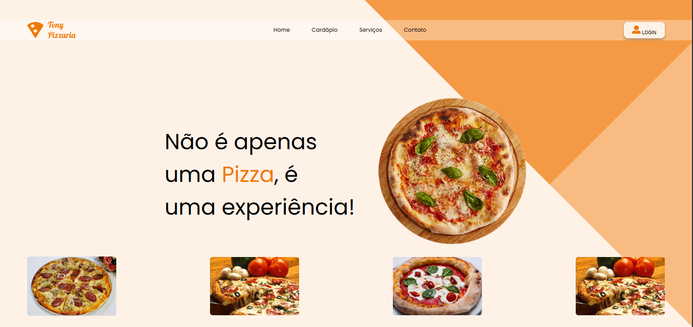

# tony-pizzaria

## Projeto
Este projeto foi dado em sala de aula com orientações do professor para treino na criação de uma página responsíva com Breakpoints

## Tecnologias
- HTML
- CSS
## Autora
[Geovanna Silva](https://www.linkedin.com/in/geovanna-sousa-28289234a?utm_source=share&utm_campaign=share_via&utm_content=profile&utm_medium=android_app)